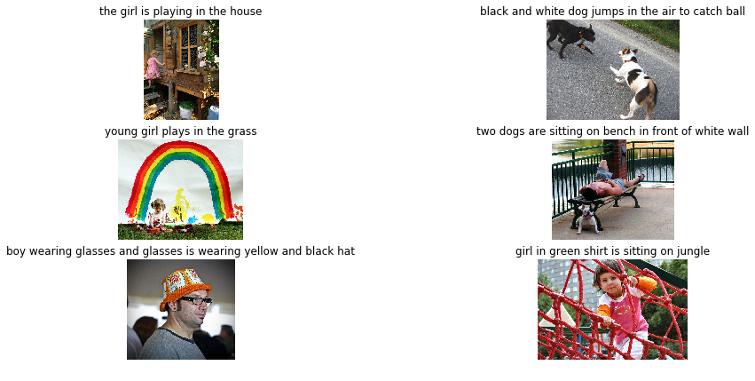
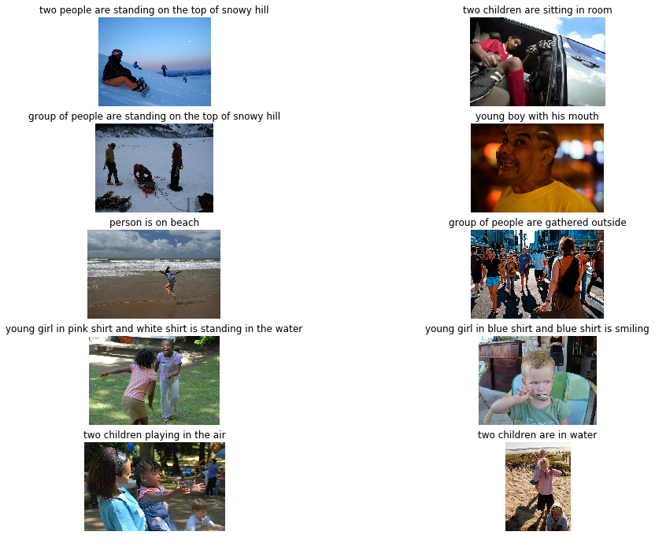
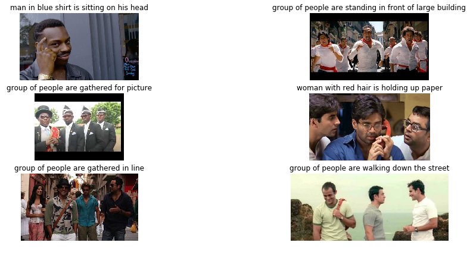

# Image_Captioning

Image captioning model, using encoder-decoder model.I used  CNN as encoder and LSTM as decoder. I used VGG16 model to encode images and Glove 200-dimension vectors to encode words from captions. When given an image encoding, model predicts caption one word at a time.Evalution is done by BLEU-2 score which is 0.28 (test) and 0.39(train)

Result: 
Train Result:  
 
   
Test Result:  

  
Random Result:  

